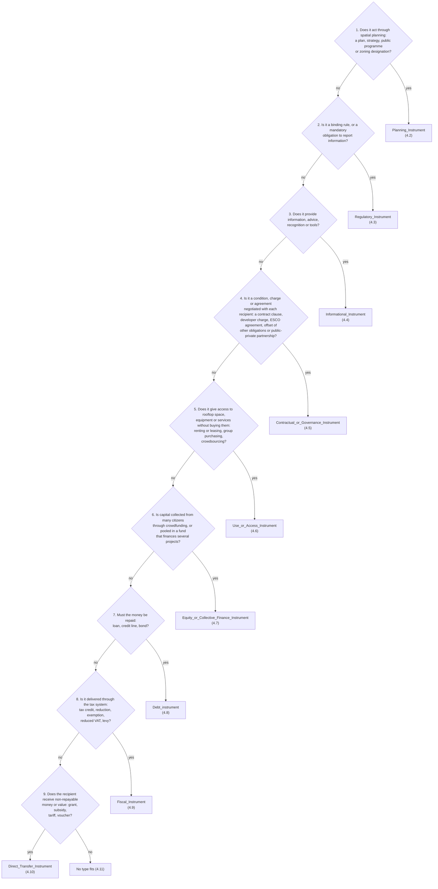

# Registering incentives

This section explains how to record, in your own data, a specific incentive implemented in a region (for example a green roof grant or an advice desk), how to choose its instrument type with a decision tree, and how to describe it with the right properties.

## 1. What an incentive individual is

The ontology defines **incentive types** as classes (`Grant`, `Voucher`, `Advisory_Service`, etc.). An **incentive individual** is one concrete measure, such as the green roof grant of a given region. You create it in your own data and give it:

1. **One instrument type**, which says *what kind of instrument* it is (section 4).
2. **Facets**, which say *how it works*: its nature, function, funding source, allocation mechanism, obligation attachment and project stage (sections 5 and 6).
3. **Other properties**: the region where it is implemented, a description, the rooftop types it supports and its source (section 7).

A reasoner then classifies the incentive automatically into defined classes such as `Publicly_Funded_Incentive` or `Person-based_Incentive` (section 11).

Incentive individuals are different from the association degrees of the association tutorial. Associations say how suitable an incentive *type* is for an owner *type*; incentive individuals record the measures that actually exist.

Prefixes used in this section:

| Prefix | Namespace |
|---|---|
| `:` | `https://w3id.org/rooftop_activation#` |
| `ex:` | your own namespace, for example `https://example.org/my-region#` |

## 2. Before you start

1. **Create your own data file.** Do not edit the ontology. Create a separate ontology for your data that imports `https://w3id.org/rooftop_activation`, and use your own namespace for everything you create.
2. **Identify the region.** Use an existing `Region` individual (`:Brussels`, `:Dublin`, `:Ile_de_France`, `:Mannheim`, `:Mechelen`, `:Rotterdam`) or create your own individual of type `Region`.
3. **Gather the information about the incentive.** Before opening Protégé, answer these questions from the official source (regulation, call text, programme website):

   | Question | Used for |
   |---|---|
   | What does the recipient receive or have to do? | Instrument type (section 4) |
   | Who pays for it (EU, national, regional, municipal, private, community)? | Funding source |
   | How are recipients selected (ranking, automatic, first come, negotiation)? | Allocation mechanism |
   | Does the benefit or obligation follow the person, the project or the property? | Obligation attachment |
   | When does it act: before the investment decision, at installation, during operation? | Project stage |
   | What does it do for the project (lower up-front costs, reduce risk, etc.)? | Function |
   | Which rooftop activation types does it support? | Rooftop types |

## 3. How an incentive is described

| What | How it is written | Values |
|---|---|---|
| Instrument type | Class assertion (`rdf:type`) | One class from the decision tree (section 4) |
| Nature | Class expression `has_incentive_nature some <value>` | `Contractual_Nature`, `Financial_Nature` (and its subclass `Fiscal_Nature`), `Informational_Nature`, `Organizational_Nature`, `Regulatory_Nature`. Several allowed |
| Function | Class expression `has_incentive_function some <value>` | `Building_Capacity_or_Awareness`, `Coordinating_Actors`, `De-risking`, `Improving_Operating_Economics`, `Mandating_or_Constraining`, `Raising_Additional_Capital`, `Reducing_Transaction_Costs`, `Reducing_Up-Front_Costs`, `Stimulating_Market_or_Innovation`. Several allowed |
| Funding source | Class expression `has_funding_source some <value>` | `Community_Source`, `Private_Source`, `Public_Source` (or, more precisely, `European_Source`, `National_Source`, `Regional_Source`, `Municipal_Source`). Several allowed |
| Allocation mechanism | Class expression `has_allocation_mechanism some <value>` | `Competitive_Allocation`, `Entitlement_Allocation`, `First-come_Allocation`, `Negotiated_Allocation`. **At most one** |
| Obligation attachment | Class expression `has_obligation_attachment some <value>` | `Attached_to_Person`, `Attached_to_Project`, `Attached_to_Property`. **At most one** |
| Project stage | Class expression `applies_at_stage some <value>` | `Pre-investment_Stage`, `Investment_Stage`, `Operation_Stage`. Several allowed |

**Why facets are class expressions.** Facet values are classes in the ontology, and it contains no individuals for them. You therefore state a facet as an additional type of the incentive, for example "this incentive is something that `has_funding_source some Regional_Source`". This is the same pattern the ontology uses to define its instrument types, and it lets the reasoner classify the incentive and detect contradictions. Do not create your own individuals for facet values, and do not use the class names directly as values of object property assertions.

## 4. Step 1: choose the instrument type

Every incentive has **one** instrument type. The nine instrument families are disjoint: an incentive cannot be, for example, both a `Grant` and a `Tax_Credit`. If a programme combines several instruments (for example a grant plus free advice), register one incentive individual per instrument.

### 4.1 Choose the family

Answer the questions in order and stop at the first "yes". The order matters: it resolves the cases where more than one description seems to fit.



### 4.2 Planning_Instrument

| If the incentive is... | Type |
|---|---|
| A plan, strategy or policy document that sets objectives or priorities for rooftop activation | `Planning_or_Policy` |
| A programme or zoning rule that designates areas, targets or requirements, such as a green area factor | `Program_or_Zoning_Approach` |

### 4.3 Regulatory_Instrument

| If the incentive is... | Type |
|---|---|
| A binding rule that requires, permits or forbids rooftop activation, such as a mandatory green or solar roof for new buildings | `Regulation` |
| An obligation to report or publish information about a building or its rooftop | `Disclosure` |

### 4.4 Informational_Instrument

| If the incentive is... | Type |
|---|---|
| Technical, legal or financial advice to assess and prepare a project | `Advisory_Service` |
| A campaign, event or outreach that raises awareness | `Information_or_Engagement` |
| A certification, label or award for activated rooftops | `Label_or_Recognition` |
| An online platform connecting owners, providers, investors or users, or managing the process | `Digital_Platform_Service` |
| A map or cadastre showing the activation potential of rooftops | `Mapping_Tools` |
| Another tool to identify, assess or plan rooftop activation | `Tools` |

### 4.5 Contractual_or_Governance_Instrument

| If the incentive is... | Type |
|---|---|
| A clause in a lease, sale, concession or permit that requires or rewards rooftop activation | `Contractual_Condition` |
| A development or impact charge reduced or waived when a rooftop is activated | `Developer_or_Charge_Fee` |
| An agreement with an energy service company or similar provider that designs, finances and operates the installation and recovers its investment from savings or revenues | `ESCO_or_Sustainability_Agreement` |
| A mechanism that lets rooftop activation count towards other obligations, such as required green space, parking or stormwater retention | `Offset_or_Deduction_Mechanism` |
| A long-term arrangement in which a public authority and private partners share financing, delivery and risks | `Public-Private_Partnerships` |

### 4.6 Use_or_Access_Instrument

| If the incentive is... | Type |
|---|---|
| Use of rooftop space or equipment through a rental or lease | `Renting_or_Leasing` |
| Pooling of demand from several owners to buy jointly or deliver a shared project | `Group_Purchases_and_Collective_Project` |
| Collection of ideas, rooftop offers or volunteer work from the public | `Crowdsourcing` |

### 4.7 Equity_or_Collective_Finance_Instrument

| If the incentive is... | Type |
|---|---|
| Many small contributions from people, usually through an online platform, as donations, loans or equity | `Crowdfunding_Crowdlending_and_Crowd_Equity` |
| A pool of capital that finances several projects... | `Fund`, or more precisely: |
| ...held in a dedicated legal entity, such as a special purpose vehicle | `Funding_Vehicle` |
| ...taking equity or quasi-equity positions for a financial return | `Investment` |
| ...reinvesting repayments and returns in new projects | `Revolving` |
| ...in steward ownership, with profits bound to its mission | `Steward-Owned` |

### 4.8 Debt_instrument

| If the incentive is... | Type |
|---|---|
| A debt security issued to investors... | `Bond`, or, if its proceeds are earmarked for environmental projects, `Green_Bond`, or more precisely: |
| ...issued for specific projects whose risk investors bear directly | `Green_Project_Bond` |
| ...repaid from the revenues, fees or taxes generated by the projects | `Green_Revenue` |
| ...backed by collateral from the projects | `Secured_Green` |
| ...with recourse to the issuer's full balance sheet | `Standard_Green_Use_of_Proceeds_Bond` |
| Capital lent and repaid over time... | `Loan`, or more precisely: |
| ...repaid through the utility bill | `On-bill_Financing`, or `On-bill_Repayment` if the capital comes from a third-party lender |
| ...repaid through a surcharge on the property tax bill | `On-tax_Financing` |
| ...secured on the property, the balance transferring with ownership | `Property-linked_Loans` |
| ...as a credit line that can be drawn, repaid and drawn again | `Revolving_Credit` |

### 4.9 Fiscal_Instrument

| If the incentive is... | Type |
|---|---|
| An amount deducted from the tax owed by a taxpayer who invests in rooftop activation | `Tax_Credit`, or `Citizen_Micro-investment_Tax_Credit` for small citizen investments, for example through a cooperative |
| A tax reduction or exemption, or a reduced VAT rate, granted automatically for eligible works | `TAX_or_VAT_Incentive` |
| A levy, fee or rate adjustment that makes non-activated rooftops more costly than activated ones | `Fiscal_Measure` |

### 4.10 Direct_Transfer_Instrument

| If the incentive is... | Type |
|---|---|
| A voucher of fixed value, redeemable for goods or services such as a feasibility study | `Voucher` |
| A recurring payment or price support during operation... | `Subsidy`, or `Feed-in_Tariff` if it is a guaranteed price per unit of energy fed into the grid |
| A non-repayable sum to fund a defined project... | `Grant`, or more precisely one or more of: |
| ...combining public money with private capital | `Blended_Finance_Program` |
| ...awarded through a call for projects with ranking against criteria | `Call_for_Projects_or_Competitive_Grant` |
| ...paid, fully or partly, before the works | `Pre-financed_Grant` |

The three `Grant` subtypes are the only instrument types that can be combined: a grant awarded through a call and paid in advance is both `Call_for_Projects_or_Competitive_Grant` and `Pre-financed_Grant`. All other sibling types are disjoint.

### 4.11 Boundary cases

| Situation | Choose | Not |
|---|---|---|
| A green area factor or other zoning designation | `Program_or_Zoning_Approach` | `Regulation` |
| A building code obligation that applies to all new buildings | `Regulation` | `Program_or_Zoning_Approach` |
| A stormwater or sealing fee based on roof area, charged every year | `Fiscal_Measure` | `Developer_or_Charge_Fee` |
| A charge levied once on a development or permit, reduced if the roof is activated | `Developer_or_Charge_Fee` | `Fiscal_Measure` |
| Crowdlending (citizens lend through a platform) | `Crowdfunding_Crowdlending_and_Crowd_Equity` | `Loan` |
| A loan an owner receives from a revolving fund | `Loan` (what the owner receives) | `Revolving` |
| The revolving fund itself, as a programme | `Revolving` | `Revolving_Credit` |
| An owner leases the roof to a solar operator | `Renting_or_Leasing` | `ESCO_or_Sustainability_Agreement` |
| A provider finances and operates the installation and is repaid from the savings | `ESCO_or_Sustainability_Agreement` | `Renting_or_Leasing` |
| A grant paid per kWh produced | `Feed-in_Tariff` | `Grant` |

**No type fits.** Do not assert only `Incentive`: the incentive would not be classified. Choose the closest type and explain the difference in the description. If a new type is needed, add a subclass in your own extension of the ontology, following section 7 of the association tutorial.

## 5. Step 2: check what the type already implies

Each instrument type already carries some facet values. The table lists them, including those inherited from parent types. Three rules follow:

1. **Do not repeat** the values listed for your type: they are already true.
2. **Do not contradict them.** For allocation mechanism and obligation attachment, only one value is allowed, so adding a different one makes the ontology inconsistent. For types with a nature marked "only", adding another nature also makes it inconsistent.
3. **Add what is missing** (section 6). You can add further natures, functions, funding sources and stages where no "only" applies.

| Type | Nature | Function | Funding source | Allocation | Attachment | Stage |
|---|---|---|---|---|---|---|
| `Planning_Instrument` | only Organizational |  |  |  |  |  |
| &nbsp;&nbsp;&nbsp;&nbsp;`Planning_or_Policy` | only Organizational |  |  |  |  |  |
| &nbsp;&nbsp;&nbsp;&nbsp;`Program_or_Zoning_Approach` | only Organizational |  |  |  |  |  |
| `Regulatory_Instrument` | only Regulatory |  |  |  |  |  |
| &nbsp;&nbsp;&nbsp;&nbsp;`Disclosure` | only Regulatory |  |  |  |  |  |
| &nbsp;&nbsp;&nbsp;&nbsp;`Regulation` | only Regulatory | Mandating or Constraining |  |  |  |  |
| `Informational_Instrument` | only Informational |  |  |  |  |  |
| &nbsp;&nbsp;&nbsp;&nbsp;`Advisory_Service` | only Informational | Building Capacity or Awareness |  |  |  | Pre-investment |
| &nbsp;&nbsp;&nbsp;&nbsp;`Information_or_Engagement` | only Informational |  |  |  |  | Pre-investment |
| &nbsp;&nbsp;&nbsp;&nbsp;`Label_or_Recognition` | only Informational |  |  |  |  | Operation |
| &nbsp;&nbsp;&nbsp;&nbsp;`Tools` | only Informational |  |  |  |  | Pre-investment |
| &nbsp;&nbsp;&nbsp;&nbsp;&nbsp;&nbsp;&nbsp;&nbsp;`Digital_Platform_Service` | only Informational |  |  |  |  | Pre-investment |
| &nbsp;&nbsp;&nbsp;&nbsp;&nbsp;&nbsp;&nbsp;&nbsp;`Mapping_Tools` | only Informational |  |  |  |  | Pre-investment |
| `Contractual_or_Governance_Instrument` | Contractual |  |  | Negotiated |  |  |
| &nbsp;&nbsp;&nbsp;&nbsp;`Contractual_Condition` | Contractual |  |  | Negotiated |  |  |
| &nbsp;&nbsp;&nbsp;&nbsp;`Developer_or_Charge_Fee` | Contractual |  |  | Negotiated |  |  |
| &nbsp;&nbsp;&nbsp;&nbsp;`ESCO_or_Sustainability_Agreement` | Contractual, Financial |  |  | Negotiated | Property |  |
| &nbsp;&nbsp;&nbsp;&nbsp;`Offset_or_Deduction_Mechanism` | Contractual |  |  | Negotiated |  |  |
| &nbsp;&nbsp;&nbsp;&nbsp;`Public-Private_Partnerships` | Contractual, Organizational | Raising Additional Capital | Private, Public | Negotiated |  |  |
| `Use_or_Access_Instrument` |  | Reducing Up-Front Costs |  |  |  |  |
| &nbsp;&nbsp;&nbsp;&nbsp;`Crowdsourcing` | Organizational | Reducing Up-Front Costs |  |  |  |  |
| &nbsp;&nbsp;&nbsp;&nbsp;`Group_Purchases_and_Collective_Project` | Organizational | Reducing Transaction Costs, Reducing Up-Front Costs |  |  |  |  |
| &nbsp;&nbsp;&nbsp;&nbsp;`Renting_or_Leasing` | Financial | Reducing Up-Front Costs |  |  |  |  |
| `Equity_or_Collective_Finance_Instrument` | Financial | Raising Additional Capital |  |  |  |  |
| &nbsp;&nbsp;&nbsp;&nbsp;`Crowdfunding_Crowdlending_and_Crowd_Equity` | Financial | Raising Additional Capital | Community |  |  |  |
| &nbsp;&nbsp;&nbsp;&nbsp;`Fund` | Financial | Raising Additional Capital |  |  |  |  |
| &nbsp;&nbsp;&nbsp;&nbsp;&nbsp;&nbsp;&nbsp;&nbsp;`Funding_Vehicle` | Financial | Raising Additional Capital |  |  |  |  |
| &nbsp;&nbsp;&nbsp;&nbsp;&nbsp;&nbsp;&nbsp;&nbsp;`Investment` | Financial | Raising Additional Capital |  |  |  |  |
| &nbsp;&nbsp;&nbsp;&nbsp;&nbsp;&nbsp;&nbsp;&nbsp;`Revolving` | Financial | Raising Additional Capital |  |  |  |  |
| &nbsp;&nbsp;&nbsp;&nbsp;&nbsp;&nbsp;&nbsp;&nbsp;`Steward-Owned` | Financial | Raising Additional Capital | Community |  |  |  |
| `Debt_instrument` | Financial |  |  |  |  |  |
| &nbsp;&nbsp;&nbsp;&nbsp;`Bond` | Financial |  |  |  |  | Investment |
| &nbsp;&nbsp;&nbsp;&nbsp;&nbsp;&nbsp;&nbsp;&nbsp;`Green_Bond` | Financial | Raising Additional Capital | Private |  |  | Investment |
| &nbsp;&nbsp;&nbsp;&nbsp;&nbsp;&nbsp;&nbsp;&nbsp;&nbsp;&nbsp;&nbsp;&nbsp;`Green_Project_Bond` | Financial | Raising Additional Capital | Private |  |  | Investment |
| &nbsp;&nbsp;&nbsp;&nbsp;&nbsp;&nbsp;&nbsp;&nbsp;&nbsp;&nbsp;&nbsp;&nbsp;`Green_Revenue` | Financial | Raising Additional Capital | Private |  |  | Investment |
| &nbsp;&nbsp;&nbsp;&nbsp;&nbsp;&nbsp;&nbsp;&nbsp;&nbsp;&nbsp;&nbsp;&nbsp;`Secured_Green` | Financial | Raising Additional Capital | Private |  |  | Investment |
| &nbsp;&nbsp;&nbsp;&nbsp;&nbsp;&nbsp;&nbsp;&nbsp;&nbsp;&nbsp;&nbsp;&nbsp;`Standard_Green_Use_of_Proceeds_Bond` | Financial | Raising Additional Capital | Private |  |  | Investment |
| &nbsp;&nbsp;&nbsp;&nbsp;`Loan` | Financial |  |  |  |  | Investment |
| &nbsp;&nbsp;&nbsp;&nbsp;&nbsp;&nbsp;&nbsp;&nbsp;`On-bill_Financing` | Contractual, Financial |  |  |  | Property | Investment |
| &nbsp;&nbsp;&nbsp;&nbsp;&nbsp;&nbsp;&nbsp;&nbsp;&nbsp;&nbsp;&nbsp;&nbsp;`On-bill_Repayment` | Contractual, Financial |  |  |  | Property | Investment, Operation |
| &nbsp;&nbsp;&nbsp;&nbsp;&nbsp;&nbsp;&nbsp;&nbsp;`On-tax_Financing` | Financial, Fiscal |  |  |  | Property | Investment |
| &nbsp;&nbsp;&nbsp;&nbsp;&nbsp;&nbsp;&nbsp;&nbsp;`Property-linked_Loans` | Financial |  |  |  | Property | Investment |
| &nbsp;&nbsp;&nbsp;&nbsp;&nbsp;&nbsp;&nbsp;&nbsp;`Revolving_Credit` | Financial |  |  |  | Person | Investment |
| `Fiscal_Instrument` | Fiscal |  |  |  |  |  |
| &nbsp;&nbsp;&nbsp;&nbsp;`Fiscal_Measure` | Fiscal |  |  |  |  |  |
| &nbsp;&nbsp;&nbsp;&nbsp;`TAX_or_VAT_Incentive` | Fiscal |  |  | Entitlement | Person |  |
| &nbsp;&nbsp;&nbsp;&nbsp;`Tax_Credit` | Fiscal |  |  | Entitlement | Person |  |
| &nbsp;&nbsp;&nbsp;&nbsp;&nbsp;&nbsp;&nbsp;&nbsp;`Citizen_Micro-investment_Tax_Credit` | Fiscal |  |  | Entitlement | Person |  |
| `Direct_Transfer_Instrument` | Financial |  |  |  |  |  |
| &nbsp;&nbsp;&nbsp;&nbsp;`Grant` | Financial |  |  |  | Project | Investment |
| &nbsp;&nbsp;&nbsp;&nbsp;&nbsp;&nbsp;&nbsp;&nbsp;`Blended_Finance_Program` | Financial |  | Private, Public |  | Project | Investment |
| &nbsp;&nbsp;&nbsp;&nbsp;&nbsp;&nbsp;&nbsp;&nbsp;`Call_for_Projects_or_Competitive_Grant` | Financial |  |  | Competitive | Project | Investment |
| &nbsp;&nbsp;&nbsp;&nbsp;&nbsp;&nbsp;&nbsp;&nbsp;`Pre-financed_Grant` | Financial | Reducing Up-Front Costs |  |  | Project | Investment, Pre-investment |
| &nbsp;&nbsp;&nbsp;&nbsp;`Subsidy` | Financial |  |  |  | Project | Operation |
| &nbsp;&nbsp;&nbsp;&nbsp;&nbsp;&nbsp;&nbsp;&nbsp;`Feed-in_Tariff` | Financial | Improving Operating Economics |  |  | Project | Operation |
| &nbsp;&nbsp;&nbsp;&nbsp;`Voucher` | Financial | Reducing Up-Front Costs |  |  | Person | Investment |

## 6. Step 3: add the facets

Add each facet as a class expression (section 3), unless the table in section 5 already gives it.

### 6.1 Nature

The nature is already given by every instrument type in section 5. Add a second nature only if the incentive really combines levers, for example a contractual condition that also includes a payment (`has_incentive_nature some Financial_Nature`). This is not possible for planning, regulatory and informational instruments, whose nature is marked "only".

### 6.2 Function

If section 5 gives no function for your type, add at least one. Choose every function that applies:

| What does the incentive change for the project? | Function |
|---|---|
| It lowers the capital the owner must mobilise at the moment of investment | `Reducing_Up-Front_Costs` |
| It improves recurring revenue or lowers recurring costs during operation | `Improving_Operating_Economics` |
| It brings in third-party capital that would not otherwise reach the project | `Raising_Additional_Capital` |
| It transfers or absorbs technical, financial or performance risk | `De-risking` |
| It lowers search, negotiation, procurement or administrative effort | `Reducing_Transaction_Costs` |
| It increases the knowledge, skills or motivation of owners and intermediaries | `Building_Capacity_or_Awareness` |
| It aligns the decisions of several parties | `Coordinating_Actors` |
| It obliges or forbids an action | `Mandating_or_Constraining` |
| It develops supply, demand or technology beyond a single project | `Stimulating_Market_or_Innovation` |

### 6.3 Funding source

Add the funding source unless section 5 gives it. Use the most specific public level you know (`European_Source`, `National_Source`, `Regional_Source`, `Municipal_Source`); use `Public_Source` only if the level is unknown. If the incentive is co-funded, add one class expression per source. Regulations and planning instruments usually have no funding source; leave it out for them.

### 6.4 Allocation mechanism

Add it only if section 5 gives none. Choose one:

| How are recipients selected? | Allocation mechanism |
|---|---|
| Applications are ranked or selected against criteria, with no guarantee of award | `Competitive_Allocation` |
| Anyone who meets the conditions receives it automatically | `Entitlement_Allocation` |
| Applications are granted in order of receipt until the budget or quota is used up | `First-come_Allocation` |
| Terms are agreed case by case between provider and recipient | `Negotiated_Allocation` |

### 6.5 Obligation attachment

Add it only if section 5 gives none. Choose one:

| If the property is sold, what happens to the benefit or obligation? | Obligation attachment |
|---|---|
| It stays with the person or company that received it | `Attached_to_Person` |
| It is tied to the project and ends when the project ends | `Attached_to_Project` |
| It transfers to the next owner or occupant | `Attached_to_Property` |

### 6.6 Project stage

Add every stage at which the incentive acts, in addition to those in section 5 (which cannot be removed):

| When does the incentive act? | Stage |
|---|---|
| Before the investment decision: awareness, feasibility, design, preparation | `Pre-investment_Stage` |
| At construction or installation, when the capital is spent | `Investment_Stage` |
| After commissioning: use, maintenance, revenue, repayment | `Operation_Stage` |

## 7. Step 4: add the other properties

| Property | Required | Value |
|---|---|---|
| `implemented_in` | required | The `Region` individual where the incentive applies. Several are allowed if the same measure applies in several regions |
| `rdfs:label` | required | A short name, with a language tag (for example `"Green roof grant"@en`) |
| `has_incentive_description` | recommended | Purpose, eligibility conditions and main features, as `xsd:string` **without a language tag**. The range of the property is `xsd:string`, so a language-tagged text makes the ontology inconsistent |
| `incentive_associated_to_rooftop` | recommended | The rooftop activation types the incentive supports, as a class expression: `incentive_associated_to_rooftop some Green_Rooftop`. Add one per supported type. Use a plain object property assertion only if the incentive is tied to one specific rooftop individual |
| `dcterms:source` | recommended | The URL of the official source |
| `dcterms:date` | recommended | The date the incentive was registered or last checked (`xsd:date`) |
| `dcterms:creator` | optional | The authority or person that registered it |

## 8. Rules

1. **One individual per measure.** If the same measure applies in several regions, use one individual with several `implemented_in` values. If the conditions differ between regions, create one individual per region.
2. **One instrument type per individual.** The only exception is the combination of `Grant` subtypes (section 4.10). A programme combining several instruments is registered as several individuals.
3. **Do not assert defined classes.** `Competitive_Incentive`, `Contractual_or_Governance_Incentive`, `European_Grant`, `European_Incentive`, `Financial_Incentive`, `Non-Financial_Incentive`, `Person-based_Incentive`, `Pre-investment_Incentive`, `Property-based_Incentive`, `Publicly_Funded_Incentive`, `Reducing_Up-Front_Cost_Incentive` and `Regulatory_Incentive` are inferred by the reasoner (section 11).
4. **Do not create individuals for facet values** and do not use facet classes as values of object property assertions. Use class expressions (section 3).
5. **Use a naming convention.** For example `inc_<Region>_<short_name>`, such as `inc_Brussels_green_roof_grant`.

## 9. Incentives in Turtle

In Turtle, each class expression is written as an anonymous `owl:Restriction` among the types of the individual.

```turtle
@prefix :        <https://w3id.org/rooftop_activation#> .
@prefix ex:      <https://example.org/my-region#> .
@prefix owl:     <http://www.w3.org/2002/07/owl#> .
@prefix rdfs:    <http://www.w3.org/2000/01/rdf-schema#> .
@prefix xsd:     <http://www.w3.org/2001/XMLSchema#> .
@prefix dcterms: <http://purl.org/dc/terms/> .

<https://example.org/my-region> a owl:Ontology ;
    owl:imports <https://w3id.org/rooftop_activation> .

# A regional grant for green roofs, granted until the budget is used up
ex:inc_Brussels_green_roof_grant
    a owl:NamedIndividual , :Grant ,
      [ a owl:Restriction ; owl:onProperty :has_funding_source ;
        owl:someValuesFrom :Regional_Source ] ,
      [ a owl:Restriction ; owl:onProperty :has_incentive_function ;
        owl:someValuesFrom :Reducing_Up-Front_Costs ] ,
      [ a owl:Restriction ; owl:onProperty :has_allocation_mechanism ;
        owl:someValuesFrom :First-come_Allocation ] ,
      [ a owl:Restriction ; owl:onProperty :incentive_associated_to_rooftop ;
        owl:someValuesFrom :Green_Rooftop ] ;
    rdfs:label                 "Green roof grant"@en ;
    :implemented_in            :Brussels ;
    :has_incentive_description "Non-repayable grant covering part of the cost of installing a green roof on an existing building. Paid after the works, on presentation of invoices, until the annual budget is used up."^^xsd:string ;
    dcterms:source             <https://example.org/green-roof-grant> ;
    dcterms:date               "2026-10-01"^^xsd:date .

# Free technical advice for owners, paid by the city
ex:inc_Rotterdam_rooftop_advice
    a owl:NamedIndividual , :Advisory_Service ,
      [ a owl:Restriction ; owl:onProperty :has_funding_source ;
        owl:someValuesFrom :Municipal_Source ] ,
      [ a owl:Restriction ; owl:onProperty :has_allocation_mechanism ;
        owl:someValuesFrom :Entitlement_Allocation ] ,
      [ a owl:Restriction ; owl:onProperty :has_obligation_attachment ;
        owl:someValuesFrom :Attached_to_Person ] ;
    rdfs:label                 "Rooftop advice desk"@en ;
    :implemented_in            :Rotterdam ;
    :has_incentive_description "Free technical and financial advice for owners who want to assess the activation potential of their roof."^^xsd:string .
```

The incentives, descriptions and source above are illustrative. How they were built with the decision tree:

- **Green roof grant:** non-repayable money for a defined project, so questions 1 to 8 are "no" and question 9 is "yes" (section 4.10): `Grant`. Section 5 already gives nature, attachment and stage, so only function, funding source, allocation and rooftop type are added.
- **Advice desk:** question 3 is "yes" (section 4.4): `Advisory_Service`. Section 5 already gives nature, function and stage, so only funding source, allocation and attachment are added.

## 10. Registering an incentive in Protégé

1. Open your data ontology (the one that imports the Rooftop Activation Ontology).
2. Go to **Entities > Individuals** and click **Add individual**. Enter the name, for example `inc_Brussels_green_roof_grant`, and check that the IRI uses your namespace.
3. **Instrument type.** In **Description > Types**, click **+**, open the **Class hierarchy** tab and select the type chosen in section 4, for example `Grant`.
4. **Facets.** For each facet value from section 6, click **+** next to **Types** again, open the **Class expression editor** tab and type the expression, for example `has_funding_source some Regional_Source`. Click **OK**. Repeat for each value, and for each supported rooftop type (`incentive_associated_to_rooftop some Green_Rooftop`).
5. **Region.** In **Property assertions > Object property assertions**, click **+**, select `implemented_in` and then your region.
6. **Description.** In **Property assertions > Data property assertions**, click **+**, select `has_incentive_description`, enter the text, set the type to `xsd:string` and leave the language empty.
7. **Annotations.** In **Annotations**, click **+** to add `rdfs:label` (with language `en`), and `dcterms:source` and `dcterms:date` if available.
8. **Check.** Run the reasoner (**Reasoner > HermiT > Start reasoner**). The inferred types appear with a yellow background in **Description > Types**. If Protégé reports an inconsistency, see section 11.
9. Save your data ontology.

## 11. What the reasoner infers, and checking your data

### Inferred classes

| Defined class | Inferred when the incentive... |
|---|---|
| `Financial_Incentive` | has a financial (or fiscal) nature |
| `Non-Financial_Incentive` | is known not to be financial. In practice: planning, regulatory and informational instruments, whose nature is closed with "only" |
| `Regulatory_Incentive` | has a regulatory nature |
| `Contractual_or_Governance_Incentive` | has a contractual or organisational nature |
| `Publicly_Funded_Incentive` | has a public funding source at any level |
| `European_Incentive` | has a European funding source |
| `European_Grant` | is a `Grant` with a European funding source |
| `Competitive_Incentive` | has competitive allocation |
| `Person-based_Incentive` | is attached to the person |
| `Property-based_Incentive` | is attached to the property |
| `Pre-investment_Incentive` | applies at the pre-investment stage |
| `Reducing_Up-Front_Cost_Incentive` | has the function of reducing up-front costs |

For the examples in section 9, the reasoner infers that the grant is a `Financial_Incentive`, `Publicly_Funded_Incentive` and `Reducing_Up-Front_Cost_Incentive`, and that the advice desk is a `Non-Financial_Incentive`, `Publicly_Funded_Incentive`, `Person-based_Incentive` and `Pre-investment_Incentive`.

### Common causes of inconsistency

If the reasoner reports the ontology as inconsistent after you add an incentive, check for:

| Cause | Example |
|---|---|
| Two instrument types from different families or disjoint siblings | `Tax_Credit` and `Grant` |
| A second allocation mechanism | `Call_for_Projects_or_Competitive_Grant` with `has_allocation_mechanism some First-come_Allocation` |
| A second obligation attachment | `Voucher` with `has_obligation_attachment some Attached_to_Property` |
| A nature excluded by an "only" | `Advisory_Service` with `has_incentive_nature some Financial_Nature` |
| A language tag on the description | `"A grant."@en` as value of `has_incentive_description` |

In Protégé, click **Explain** in the inconsistency dialog to see the axioms involved.

### Completeness

OWL does not report missing values. Run this query on a dataset that contains both the ontology and your data. It lists incentives without region, description, function or funding source (funding source is not checked for regulatory and planning instruments). It should return no rows.

```sparql
PREFIX :     <https://w3id.org/rooftop_activation#>
PREFIX owl:  <http://www.w3.org/2002/07/owl#>
PREFIX rdfs: <http://www.w3.org/2000/01/rdf-schema#>

SELECT ?incentive ?problem
WHERE {
  ?incentive a ?type .
  ?type rdfs:subClassOf+ :Incentive .
  FILTER (isIRI(?incentive))
  {
    FILTER NOT EXISTS { ?incentive :implemented_in ?region }
    BIND ("missing implemented_in" AS ?problem)
  } UNION {
    FILTER NOT EXISTS { ?incentive :has_incentive_description ?d }
    BIND ("missing has_incentive_description" AS ?problem)
  } UNION {
    FILTER NOT EXISTS {
      ?incentive a/rdfs:subClassOf* ?r .
      ?r owl:onProperty :has_incentive_function ;
         owl:someValuesFrom ?f .
      FILTER (?f != :Incentive_Function)
    }
    BIND ("no incentive function" AS ?problem)
  } UNION {
    FILTER NOT EXISTS {
      ?incentive a/rdfs:subClassOf* ?r .
      ?r owl:onProperty :has_funding_source .
    }
    FILTER NOT EXISTS {
      ?incentive a/rdfs:subClassOf* ?family .
      VALUES ?family { :Regulatory_Instrument :Planning_Instrument }
    }
    BIND ("no funding source" AS ?problem)
  }
}
ORDER BY ?incentive ?problem
```

## 12. Reading the facets of an incentive

Because facets are class expressions, they are stored as restrictions, both on the incentive and on its instrument type. This query collects them without a reasoner. Run it on a dataset that contains both the ontology and your data, and replace `ex:inc_Brussels_green_roof_grant` with the IRI of your incentive.

```sparql
PREFIX :     <https://w3id.org/rooftop_activation#>
PREFIX owl:  <http://www.w3.org/2002/07/owl#>
PREFIX rdfs: <http://www.w3.org/2000/01/rdf-schema#>
PREFIX ex:   <https://example.org/my-region#>

SELECT DISTINCT ?facet ?restriction ?value ?origin
WHERE {
  BIND (ex:inc_Brussels_green_roof_grant AS ?incentive)   # <- replace with your incentive IRI
  ?incentive a/rdfs:subClassOf* ?r .
  ?r owl:onProperty ?facet .
  { ?r owl:someValuesFrom ?value . BIND ("some" AS ?restriction) }
  UNION
  { ?r owl:allValuesFrom ?value . BIND ("only" AS ?restriction) }
  FILTER (isIRI(?value))
  FILTER (?value NOT IN (:Incentive_Nature, :Incentive_Function))
  BIND (IF(EXISTS { ?incentive a ?r }, "asserted", "from instrument type") AS ?origin)
}
ORDER BY ?facet ?value
```

| Column | Meaning |
|---|---|
| `facet` | The facet property |
| `restriction` | `some` (the incentive has this value) or `only` (all its values belong to this class) |
| `value` | The facet value |
| `origin` | `asserted` if added to the incentive, `from instrument type` if implied by its type |

For the green roof grant of section 9, the query returns:

| facet | restriction | value | origin |
|---|---|---|---|
| `applies_at_stage` | some | `Investment_Stage` | from instrument type |
| `has_allocation_mechanism` | some | `First-come_Allocation` | asserted |
| `has_funding_source` | some | `Regional_Source` | asserted |
| `has_incentive_function` | some | `Reducing_Up-Front_Costs` | asserted |
| `has_incentive_nature` | some | `Financial_Nature` | from instrument type |
| `has_obligation_attachment` | some | `Attached_to_Project` | from instrument type |
| `incentive_associated_to_rooftop` | some | `Green_Rooftop` | asserted |
